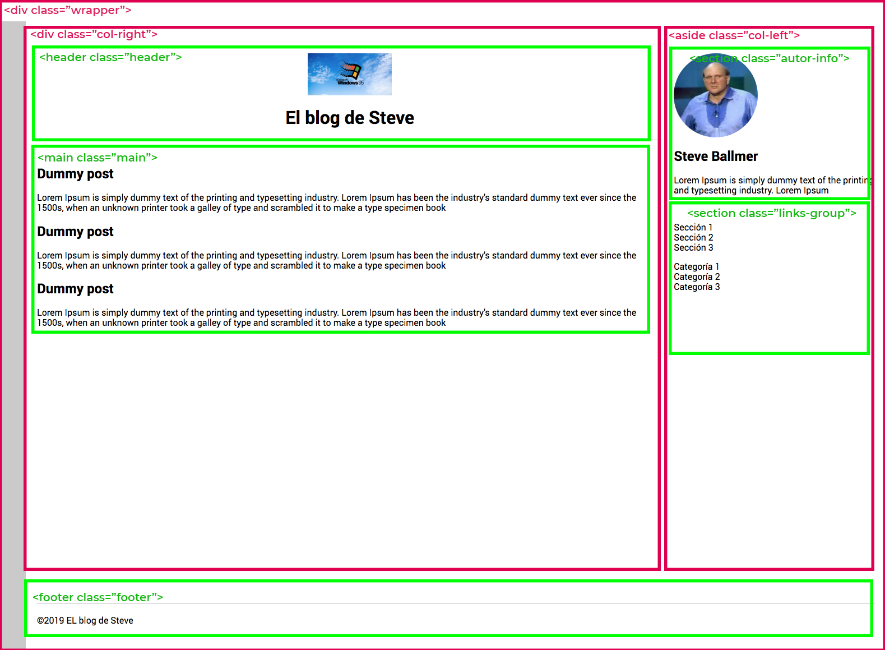

# Repaso para la evaluación final del módulo 1

Enunciado: https://books.adalab.es/materiales-front-end-h/modulo-1.-hola-mundo/1_repaso

Estructura: 

# Pasos

- [x] Copiar kit con los archivos ocultos a la vista
- [x] npm install
- [x] npm start
- [x] Asegurar el repo: subir el primer commit y ver que está funcionando
- [x] Pintar la estructura de contenedores generales (si pongo border los veré mejor)
- [x] Creamos la estructura semántica (con BEM)  (si pongo border los veré mejor)
- [x] Crear estructura de partials html y scss
- [x] Colocar / distribuir los containers usando background y bordes para verlos mejor
- [x] Meter contenido textos e imágenes
- [x] Maquetar de fuera hacia dentro los componentes interiores e ir afinando
- [x] Crearía la carpeta docs/, la subo y la publico con GitHub Pages